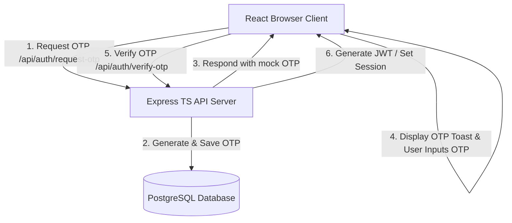

# Phase 1: Foundation & Auth - Research

**Researched:** 2026-07-07
**Domain:** Full-Stack Boilerplate with Express (TypeScript), React 18 (Vite, Tailwind, Shadcn), Prisma ORM (PostgreSQL), and Mock OTP
**Confidence:** HIGH

<user_constraints>
## User Constraints (from CONTEXT.md)

### Locked Decisions
- **D-01:** Node.js + Express backend API.
- **D-02:** Use REST endpoints for communication between frontend and backend.
- **D-03:** PostgreSQL as the database.
- **D-04:** Use Prisma ORM for schema definitions, migrations, and query building.
- **D-05:** Mock OTP-based phone login for citizens.
- **D-06:** The mock OTP code must be displayed via an on-screen mock toast notification in the UI for ease of login testing.
- **D-07:** Tailwind CSS custom theme containing tricolor-inspired branding (Navy, Saffron, Green, White).
- **D-08:** Use Shadcn UI for clean and polished components.

### the agent's Discretion
- Backend structure (controllers, routing, middleware).
- Specific Express libraries for security/utilities (cors, helmet, dotenv).
- Toast notification library choice (Sonner).
- Exact design, placement, and visual styles of the OTP entry screen.

### Deferred Ideas (OUT OF SCOPE)
- Real SMS gateway integration (OTP) — deferred.
- Real DigiLocker / Aadhaar verification — deferred.

</user_constraints>

<architectural_responsibility_map>
## Architectural Responsibility Map

| Capability | Primary Tier | Secondary Tier | Rationale |
|------------|-------------|----------------|-----------|
| Frontend UI Routing & Login | Browser/Client | — | React Router and Vite bundle run in browser. |
| OTP Mock Display (Toast) | Browser/Client | — | UI notification rendering. |
| OTP Generation & Request | API/Backend | — | Server generates codes and stores session/verification states. |
| User Profile & Roles | API/Backend | Database/Storage | Database persists user identities; backend enforces role checking. |
| Database Schemas | Database/Storage | — | PostgreSQL schemas managed via Prisma ORM. |

</architectural_responsibility_map>

<research_summary>
## Summary

This phase focuses on establishing a clean, type-safe full-stack workspace. The project will be divided into two main folders: `/backend` and `/frontend`.

For the database, PostgreSQL is used with Prisma ORM. We will define initial schemas for `User` (supporting phone, name, and enum roles: `CITIZEN`, `OFFICER`, `ADMIN`) and `OtpSession` (for OTP tracking).

For authentication, we will use JSON Web Tokens (JWT) stored in HTTP-only cookies or localStorage for demo purposes, alongside a mocked OTP flow where requesting an OTP causes the backend to return the code in the API response (or trigger a websocket/event) so the frontend can display it in a toast notification.

**Primary recommendation:** Initialize the monorepo-style setup with `/backend` and `/frontend` directories. Set up Prisma first, then Express TypeScript server, and finally Vite+React with Tailwind CSS and Shadcn UI.

</research_summary>

<standard_stack>
## Standard Stack

### Core
| Library | Version | Purpose | Why Standard |
|---------|---------|---------|--------------|
| express | 4.19.2 | Backend web framework | De-facto standard for Node.js REST APIs |
| prisma | 5.16.1 | Database ORM & Migrations | Type-safe queries, auto-generated TypeScript clients |
| typescript | 5.4.5 | Static typing | Necessary for catching compilation issues early |
| vite | 5.2.11 | Frontend tooling | High-performance, fast hot reloading for React |
| tailwindcss | 3.4.4 | Styling utility | Fast, responsive utility-first CSS styling |
| shadcn-ui | Latest | UI Component library | Accessible, fully customizable Radix-based components |

### Supporting
| Library | Version | Purpose | When to Use |
|---------|---------|---------|-------------|
| jsonwebtoken | 9.0.2 | Token-based sessions | Securing Express API routes |
| dotenv | 16.4.5 | Environment variable configuration | Loading configurations from `.env` |
| cors | 2.8.5 | Cross-Origin resource sharing middleware | Enabling frontend communication with backend |
| helmet | 7.1.0 | Secure Express apps by setting headers | Basic security best practices |
| sonner | 1.5.0 | Toast notification UI | Mock OTP display and notifications |

**Installation:**

Backend:
```bash
cd backend
npm init -y
npm install express cors helmet dotenv jsonwebtoken @prisma/client
npm install --save-dev typescript @types/express @types/cors @types/node @types/jsonwebtoken ts-node-dev prisma
npx prisma init
```

Frontend:
```bash
cd frontend
npm create vite@latest . -- --template react-ts
npm install tailwindcss postcss autoprefixer lucide-react sonner react-router-dom framer-motion
npx tailwindcss init -p
```

</standard_stack>

<architecture_patterns>
## Architecture Patterns

### System Architecture Diagram



### Recommended Project Structure
```
Civic Platform/
├── backend/
│   ├── prisma/
│   │   └── schema.prisma
│   ├── src/
│   │   ├── controllers/
│   │   │   └── auth.controller.ts
│   │   ├── middleware/
│   │   │   └── auth.middleware.ts
│   │   ├── routes/
│   │   │   └── auth.routes.ts
│   │   ├── app.ts
│   │   └── index.ts
│   ├── package.json
│   └── tsconfig.json
└── frontend/
    ├── src/
    │   ├── components/
    │   │   └── ui/            # Shadcn UI components
    │   ├── pages/
    │   │   └── Login.tsx
    │   ├── App.tsx
    │   ├── index.css
    │   └── main.tsx
    ├── tailwind.config.js
    ├── vite.config.ts
    └── package.json
```

### Pattern 1: Mock OTP Generation Route
**What:** Endpoint generates a 6-digit OTP, stores it in database with an expiration date, and returns it in the payload.
**When to use:** Mock authentication phase.
**Example:**
```typescript
import { Request, Response } from 'express';
import { PrismaClient } from '@prisma/client';

const prisma = new PrismaClient();

export const requestOtp = async (req: Request, res: Response) => {
  const { phone } = req.body;
  const otp = Math.floor(100000 + Math.random() * 900000).toString();
  const expiresAt = new Date(Date.now() + 5 * 60 * 1000); // 5 mins

  await prisma.otpSession.upsert({
    where: { phone },
    update: { otp, expiresAt },
    create: { phone, otp, expiresAt },
  });

  // In production, send SMS. In mock mode, send back in response.
  res.json({ success: true, message: "OTP sent successfully", mockOtp: otp });
};
```

### Anti-Patterns to Avoid
- **Storing sensitive raw phone numbers / Aadhaar IDs without hashing/masking**: Always mask/hash sensitive identifiers when displayed or logged.
- **Handling database connections per API request**: Create a single global Prisma Client instance and reuse it.

</architecture_patterns>

<dont_hand_roll>
## Don't Hand-Roll

| Problem | Don't Build | Use Instead | Why |
|---------|-------------|-------------|-----|
| Authentication tokens | Custom cryptography/session matching | jsonwebtoken (JWT) | Security holes, timing attacks, standard specs exist |
| Input validation | Raw Regex/Length checks | Zod | Robust validation schemas, automatic typescript type inference |
| Toast rendering | Custom CSS overlays and setTimeouts | Sonner | Queuing, animations, accessibility, and positioning are complex |

</dont_hand_roll>

<common_pitfalls>
## Common Pitfalls

### Pitfall 1: Prisma Client Multi-Instantiation
**What goes wrong:** Database connection pool exhaustion.
**Why it happens:** Instantiating `new PrismaClient()` in multiple files.
**How to avoid:** Create a central database helper file (e.g. `src/db.ts`) that exports a single instance of Prisma Client.

### Pitfall 2: CORS blocking local connections
**What goes wrong:** Frontend fails to call API with network errors.
**Why it happens:** Server doesn't allow cross-origin requests from `http://localhost:5173`.
**How to avoid:** Use `cors` middleware in Express configured to allow the frontend origin with credentials enabled.

</common_pitfalls>

<code_examples>
## Code Examples

### Express Cors Setup
```typescript
import express from 'express';
import cors from 'cors';
import helmet from 'helmet';

const app = express();

app.use(helmet());
app.use(cors({
  origin: process.env.FRONTEND_URL || 'http://localhost:5173',
  credentials: true
}));
app.use(express.json());
```

### Prisma Schema (User and Session)
```prisma
datasource db {
  provider = "postgresql"
  url      = env("DATABASE_URL")
}

generator client {
  provider = "prisma-client-js"
}

enum Role {
  CITIZEN
  OFFICER
  ADMIN
}

model User {
  id           String   @id @default(uuid())
  phone        String   @unique
  name         String?
  languagePref String   @default("en")
  role         Role     @default(CITIZEN)
  createdAt    DateTime @default(now())
  updatedAt    DateTime @updatedAt
}

model OtpSession {
  id        String   @id @default(uuid())
  phone     String   @unique
  otp       String
  expiresAt DateTime
  createdAt DateTime @default(now())
}
```
</code_examples>

<sota_updates>
## State of the Art (2025-2026)

| Old Approach | Current Approach | When Changed | Impact |
|--------------|------------------|--------------|--------|
| Create React App (CRA) | Vite | 2022+ | Vite is faster, uses ES Modules, is actively maintained |
| react-hot-toast | Sonner | 2023+ | Sonner is cleaner, fits perfectly with Tailwind/Shadcn |

</sota_updates>

<open_questions>
## Open Questions

1. **How strictly must role permissions be checked in Phase 1?**
   - Recommendation: Set up basic JWT verification middleware that checks roles (`CITIZEN`, `OFFICER`, `ADMIN`), but defer complex role-based route gating until phase features are implemented.

</open_questions>

<sources>
## Sources

### Primary (HIGH confidence)
- Express.js Documentation (expressjs.com)
- Prisma Documentation (prisma.io/docs)
- Vite Guide (vitejs.dev)
- Sonner Docs (emilkowalski.github.io/sonner)

</sources>

<metadata>
## Metadata

**Research scope:**
- Core technology: React 18, Express, Prisma ORM, PostgreSQL
- Patterns: Mock OTP flow, prisma multi-instantiation guard
- Pitfalls: CORS configuration, database connection leaks

**Confidence breakdown:**
- Standard stack: HIGH - industry standard
- Architecture: HIGH
- Pitfalls: HIGH
- Code examples: HIGH

**Research date:** 2026-07-07
**Valid until:** 2026-08-07
</metadata>

---

*Phase: 01-foundation-auth*
*Research completed: 2026-07-07*
*Ready for planning: yes*
